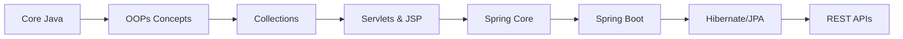

<div align="center">

# ☕ Java Learning Journey


---

### 📚 A Comprehensive Collection of Code Written During My Java Development Learning Path

*From Core Java fundamentals to Enterprise-level Spring Boot applications*

[](https://github.com/Sanket2035/Java/stargazers)
[](https://github.com/Sanket2035/Java/network/members)

</div>

---

## 📋 Table of Contents

- [Overview](#-overview)
- [Repository Structure](#-repository-structure)
- [Technology Stack](#-technology-stack)
- [Learning Modules](#-learning-modules)
  - [Core Java & OOP](#-core-java--oop)
  - [Servlets & JSP](#-servlets--jsp)
  - [Spring Framework](#-spring-framework)
  - [Hibernate ORM](#-hibernate-orm)
  - [REST APIs](#-rest-apis)
- [Project Highlights](#-project-highlights)
- [Getting Started](#-getting-started)
- [Learning Roadmap](#-learning-roadmap)
- [Author](#-author)

---

## 🎯 Overview

This repository serves as a **comprehensive archive** of my Java development learning journey. It contains practical implementations, exercises, and mini-projects covering the complete Java ecosystem from basic Object-Oriented Programming concepts to building enterprise-grade applications with Spring Boot and Hibernate.

> 💡 **Purpose**: This repository is intended as a reference guide for anyone learning Java and related frameworks. Each module builds upon the previous one, creating a structured learning path.

---

## 📁 Repository Structure

```
Java/
│
├── 🔷 CORE JAVA
│   ├── oops/                    # Object-Oriented Programming fundamentals
│   └── ecommerse/               # Core Java E-commerce project
│
├── 🌐 SERVLETS & JSP
│   └── AdvanceTask2Jsp/         # Servlet and JSP web applications
│
├── 🍃 SPRING FRAMEWORK
│   ├── spring/SpringFirst/      # Spring Framework basics
│   ├── springFirst/             # Spring configurations
│   ├── springSecond/            # Advanced Spring concepts
│   ├── AdvSecAutoWire/          # Spring AutoWiring examples
│   ├── advFirst/                # Advanced Spring module 1
│   ├── advFourth/               # Advanced Spring module 4
│   ├── advFifth/                # Advanced Spring module 5
│   └── csts/                    # Spring component scanning & testing
│
├── 🗄️ HIBERNATE ORM
│   ├── hiber/                   # Hibernate fundamentals
│   ├── hibder/                  # Advanced Hibernate mappings
│   ├── HDPack/                  # Hibernate package configurations
│   └── hd-pack/hdpack/          # Additional Hibernate examples
│
└── 🚀 REST APIs
    └── rest_api/                # Spring Boot RESTful API development
```

---

## 🛠 Technology Stack

<table>
<tr>
<td align="center" width="150">

### Languages

<br/>Java 8+
</td>
<td align="center" width="150">

### Frameworks

<br/>Spring & Spring Boot
</td>
<td align="center" width="150">

### ORM

<br/>Hibernate
</td>
<td align="center" width="150">

### Build Tool

<br/>Maven
</td>
</tr>
</table>

| Category | Technologies |
|----------|-------------|
| **Core** | Java SE, OOPs, Collections Framework, Exception Handling |
| **Web** | Servlets, JSP, HTML, CSS |
| **Framework** | Spring Core, Spring MVC, Spring Boot |
| **Persistence** | Hibernate ORM, JPA, JDBC |
| **API** | REST APIs, JSON |
| **Tools** | Maven, Eclipse/IntelliJ IDEA |

---

## 📖 Learning Modules

### 📘 Core Java & OOP

**Location**: `oops/` | `ecommerse/`

<details>
<summary><b>Click to expand module details</b></summary>

#### Topics Covered:
- **Object-Oriented Principles**
  - Classes and Objects (`Demo.java`, `Constructor.java`)
  - Inheritance and Polymorphism
  - Encapsulation and Abstraction
  - Java Keywords (`Keywords.java`)

- **String Manipulation**
  - String methods (`length.java`, `characterat.java`, `characterindex.java`)
  - Palindrome checking (`palindrome.java`)
  - String reversal (`reverse.java`)
  - Character analysis (`vovel.java`, `consonent.java`, `specialcharacter.java`)

- **Collections Framework**
  - List, Set, Map implementations (`Collection.java`, `mapdemo.java`)
  - Iteration techniques

- **Practice Programs**
  - Alphabet patterns (`alphabet.java`)
  - Character operations (`characterT.java`)
  - Task-based exercises (`task.java`, `PacMan.java`)

#### Key Files:
```
oops/src/oops/
├── Constructor.java      # Constructor concepts
├── Collection.java       # Collections framework
├── Keywords.java         # Java keywords demonstration
├── Demo.java            # Basic OOP demo
├── palindrome.java      # String palindrome logic
├── reverse.java         # String reversal
├── mapdemo.java         # Map interface examples
└── ... (15+ practice files)
```

</details>

---

### 🌐 Servlets & JSP

**Location**: `AdvanceTask2Jsp/`

<details>
<summary><b>Click to expand module details</b></summary>

#### Topics Covered:
- Servlet Lifecycle
- Request and Response handling
- JSP (JavaServer Pages)
- Web Application structure
- Session Management
- Form Processing

#### Project Structure:
```
AdvanceTask2Jsp/
├── src/main/webapp/     # Web resources
│   ├── WEB-INF/        # Configuration files
│   └── *.jsp           # JSP pages
├── .classpath
└── .project
```

</details>

---

### 🍃 Spring Framework

**Location**: `spring/`, `springFirst/`, `springSecond/`, `AdvSecAutoWire/`, `advFirst/`, `advFourth/`, `advFifth/`, `csts/`

<details>
<summary><b>Click to expand module details</b></summary>

#### Topics Covered:

| Module | Description |
|--------|-------------|
| `spring/SpringFirst` | Introduction to Spring Framework, IoC Container |
| `springFirst` | Bean configuration using XML |
| `springSecond` | Annotation-based configuration |
| `AdvSecAutoWire` | AutoWiring dependencies (`@Autowired`) |
| `advFirst` | Constructor & Setter Injection |
| `advFourth` | Spring Bean Scopes |
| `advFifth` | Spring AOP basics |
| `csts` | Component scanning & Spring Testing |

#### Key Concepts:
- **Inversion of Control (IoC)**
- **Dependency Injection (DI)**
  - Constructor Injection
  - Setter Injection
  - Field Injection
- **Bean Lifecycle & Scopes**
- **Annotations**: `@Component`, `@Service`, `@Repository`, `@Autowired`, `@Qualifier`
- **XML vs Java-based Configuration**

</details>

---

### 🗄️ Hibernate ORM

**Location**: `hiber/`, `hibder/`, `HDPack/`, `hd-pack/hdpack/`

<details>
<summary><b>Click to expand module details</b></summary>

#### Topics Covered:

| Module | Focus Area |
|--------|------------|
| `hiber` | Hibernate fundamentals, SessionFactory, Session |
| `hibder` | Entity relationships, HQL queries |
| `HDPack` | Hibernate configurations & mappings |
| `hd-pack/hdpack` | Advanced Hibernate patterns |

#### Key Concepts:
- **ORM (Object-Relational Mapping)**
- **Hibernate Configuration** (`hibernate.cfg.xml`)
- **Entity Annotations**: `@Entity`, `@Table`, `@Id`, `@Column`
- **Relationships**: One-to-One, One-to-Many, Many-to-Many
- **HQL (Hibernate Query Language)**
- **CRUD Operations**
- **Caching Mechanisms**

#### Sample Structure:
```
hiber/
├── src/
│   ├── main/
│   │   ├── java/          # Entity classes & DAOs
│   │   └── resources/     # hibernate.cfg.xml
├── pom.xml               # Maven dependencies
└── target/               # Compiled classes
```

</details>

---

### 🚀 REST APIs

**Location**: `rest_api/`

<details>
<summary><b>Click to expand module details</b></summary>

#### Topics Covered:
- RESTful Web Services principles
- Spring Boot auto-configuration
- REST Controller (`@RestController`)
- HTTP Methods: GET, POST, PUT, DELETE
- Request/Response handling
- JSON serialization/deserialization
- Exception Handling in REST

#### Project Structure:
```
rest_api/
├── .mvn/wrapper/         # Maven wrapper
├── src/
│   ├── main/
│   │   ├── java/        # Controllers, Services, Models
│   │   └── resources/   # application.properties
│   └── test/            # Unit tests
├── pom.xml              # Dependencies (Spring Boot, Web)
├── mvnw                 # Maven wrapper script (Unix)
└── mvnw.cmd             # Maven wrapper script (Windows)
```

#### Key Annotations:
```java
@RestController
@RequestMapping
@GetMapping
@PostMapping
@PutMapping
@DeleteMapping
@PathVariable
@RequestBody
@ResponseStatus
```

</details>

---

## 💎 Project Highlights

### 🛒 E-Commerce Application (Core Java)
> **Location**: `ecommerse/`

A console-based e-commerce application demonstrating core Java concepts including:
- Product management
- Shopping cart functionality
- Order processing
- OOP principles implementation

---

## 🚀 Getting Started

### Prerequisites

```bash
# Java Development Kit (JDK) 8 or higher
java -version

# Maven (for Spring Boot projects)
mvn -version

# IDE: Eclipse/IntelliJ IDEA (Recommended)
```

### Setup Instructions

1. **Clone the Repository**
   ```bash
   git clone https://github.com/Sanket2035/Java.git
   cd Java
   ```

2. **For Core Java Projects** (`oops/`, `ecommerse/`):
   - Import as Java Project in Eclipse/IntelliJ
   - Run individual `.java` files with `main()` method

3. **For Spring/Hibernate Projects**:
   ```bash
   cd <project-folder>   # e.g., cd rest_api
   mvn clean install     # Build the project
   mvn spring-boot:run   # Run (for Spring Boot)
   ```

4. **For Servlet Projects** (`AdvanceTask2Jsp/`):
   - Deploy to Apache Tomcat server
   - Access via `http://localhost:8080/<project-name>`

---

## 🗺 Learning Roadmap



| Phase | Topics | Status |
|-------|--------|--------|
| 1 | Core Java, OOPs, Collections | ✅ Complete |
| 2 | Servlets, JSP | ✅ Complete |
| 3 | Spring Framework | ✅ Complete |
| 4 | Hibernate ORM | ✅ Complete |
| 5 | REST APIs (Spring Boot) | ✅ Complete |

---

## 🤝 Contributing

While this is a personal learning repository, suggestions and improvements are welcome!

1. Fork the repository
2. Create a feature branch (`git checkout -b feature/improvement`)
3. Commit changes (`git commit -m 'Add improvement'`)
4. Push to branch (`git push origin feature/improvement`)
5. Open a Pull Request

---

## 📬 Contact

<div align="center">

**Shinde Sanket**

[](https://github.com/Sanket2035)

</div>

---

<div align="center">

### ⭐ If you found this repository helpful, please consider giving it a star!

*Happy Coding! 🚀*

---

<sub>Made with ❤️ while learning Java</sub>

</div>

